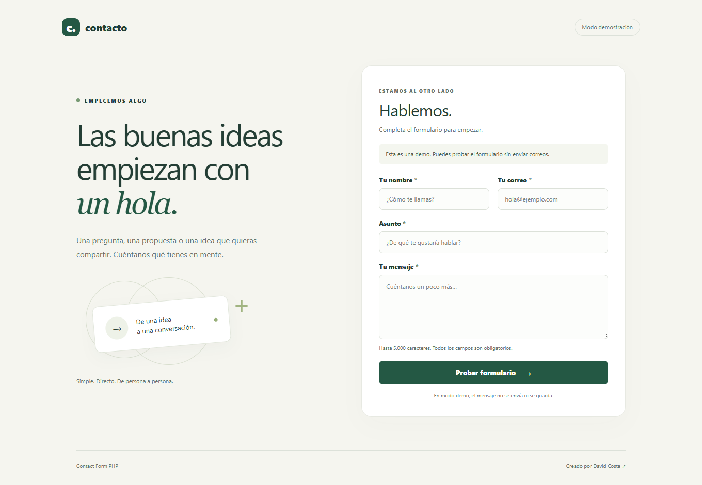

# Contact Form PHP

**Las buenas ideas empiezan con un hola.** Un formulario de contacto en español, con una interfaz adaptable, validación en el servidor y envío de correo configurable. Hecho con PHP, HTML y CSS, sin frameworks ni dependencias de Composer.

[](https://github.com/davidcostacv/Contact-Form-PHP/actions/workflows/ci.yml)
[](https://www.php.net/)
[](LICENSE)



[Ver captura móvil](docs/screenshot-mobile.png) · [Instalación](#instalación) · [Configurar correo](#configurar-el-envío-de-correo) · [Pruebas](#pruebas) · [Contribuir](#contribuir)

## Características

- Campos de nombre, correo, asunto y mensaje, con límites de longitud y validación PHP.
- Diseño responsive, etiquetas asociadas, navegación por teclado y errores accesibles.
- Funciona sin JavaScript, fuentes externas, CDN ni base de datos.
- Modo demostración por defecto: valida el mensaje sin enviarlo ni guardarlo.
- Modo real mediante `mail()` de PHP, con destinatario y remitente configurables.
- Token CSRF por sesión, campo trampa antispam y espera de 30 segundos entre intentos válidos de una misma sesión.
- Texto escapado al mostrar valores del formulario y protección contra inyección de cabeceras.
- Redirección tras un envío aceptado para evitar repetirlo al actualizar la página.
- Pruebas del procesamiento, pruebas HTTP y GitHub Actions para PHP 8.2, 8.3, 8.4 y 8.5.

## Instalación

### Requisitos

- PHP **8.2 o superior**, con sesiones habilitadas.
- Git o el ZIP descargado desde GitHub.
- Un navegador moderno.
- Para envío real: un hosting con transporte de correo configurado para PHP.
- Para ejecutar las pruebas HTTP: Python **3.9 o superior**, sin paquetes adicionales.

Comprueba que PHP está disponible con `php --version`. Puedes obtenerlo desde las [descargas oficiales](https://www.php.net/downloads.php).

```sh
git clone https://github.com/davidcostacv/Contact-Form-PHP.git
cd Contact-Form-PHP
php -S 127.0.0.1:8000 -t public
```

Abre [http://127.0.0.1:8000](http://127.0.0.1:8000). Completa los campos y pulsa **Probar formulario**. Verás una confirmación que indica que no se ha enviado ningún correo. Detén el servidor con `Ctrl+C`.

El modo demo funciona sin crear `config.php`. No se necesita Composer, npm ni una base de datos. El servidor integrado de PHP es para desarrollo local; utiliza un servidor de producción para publicar el proyecto.

## Configurar el envío de correo

Copia el ejemplo a `config.php` en la raíz del repositorio, **fuera de `public/`**.

En macOS/Linux:

```sh
cp config.example.php config.php
```

En PowerShell:

```powershell
Copy-Item config.example.php config.php
```

Edita los valores con direcciones reales autorizadas por tu proveedor:

```php
<?php
return [
    'mode' => 'mail',
    'to' => 'contacto@tu-dominio.com',
    'from' => 'web@tu-dominio.com',
];
```

| Opción | Uso |
| --- | --- |
| `mode` | `demo` para probar sin enviar; `mail` para usar el transporte de PHP. |
| `to` | Buzón que recibirá los mensajes. |
| `from` | Remitente fijo autorizado por el hosting. El correo del visitante se usa como `Reply-To`. |

`config.php` está excluido de Git. El asunto del correo es **Nuevo mensaje de contacto**; el asunto escrito por el visitante se incluye en el cuerpo junto con su nombre, correo y mensaje.

`mail()` depende de la configuración del servidor: normalmente un MTA/sendmail en Linux o un relay compatible configurado en Windows. Este proyecto no incluye cliente SMTP autenticado, contraseña ni integración con un proveedor. Para usar SMTP con usuario, contraseña y TLS, adapta el transporte mediante una biblioteca como PHPMailer.

Cuando el transporte falla, el formulario conserva los valores y muestra un error. Una respuesta positiva de `mail()` indica aceptación para envío, **no garantiza recepción en el buzón**. Comprueba la entrega, los registros del hosting y la configuración SPF/DKIM/DMARC con tu proveedor. Consulta el [manual oficial de mail()](https://www.php.net/manual/en/function.mail.php).

Para volver a la demostración, cambia `mode` a `demo`.

## Estructura

```text
Contact-Form-PHP/
├── .github/workflows/ci.yml    # Sintaxis y pruebas en cuatro versiones de PHP
├── public/                    # Único directorio que debe exponerse por HTTP
│   ├── index.php              # Controlador y formulario
│   ├── style.css              # Estilos responsive
│   └── favicon.svg            # Icono local
├── src/contact.php            # Validación, controles de envío y transporte
├── tests/
│   ├── run.php                # Pruebas del módulo PHP
│   └── http_test.py           # Pruebas HTTP con correo capturado localmente
├── docs/                      # Diseño, plan y capturas reales
├── config.example.php         # Plantilla de configuración
├── LICENSE                    # Apache 2.0
└── README.md
```

## Flujo y límites

1. Al abrir la página, PHP inicia una sesión y genera un token CSRF.
2. El navegador envía los campos por POST. PHP verifica el token, el campo antispam y los datos.
3. Los campos admiten hasta 100 caracteres para nombre, 254 para correo, 150 para asunto y 5.000 para mensaje. Nombre, correo y asunto no admiten saltos de línea.
4. Un intento con datos válidos consume la espera de 30 segundos por sesión, también si falla el transporte. Los errores de validación pueden corregirse de inmediato.
5. El modo demo termina sin enviar correo; el modo real llama al transporte configurado.
6. Tras un resultado positivo, se rota el token y se redirige a la página para mostrar una confirmación una sola vez.

El contenido del mensaje no se almacena en archivos ni en una base de datos de la aplicación. La sesión guarda el token, la hora del último intento y la confirmación temporal. En modo real, el correo y los sistemas del proveedor sí pueden conservar el mensaje.

La limitación por sesión y el campo antispam son medidas básicas: no sustituyen un límite global o por IP, una protección del proxy ni un servicio antispam en sitios con tráfico público elevado. Si necesitas un aviso de privacidad específico para tu servicio, adapta el texto del formulario antes de publicarlo.

## Pruebas

Desde la raíz del repositorio:

```sh
php tests/run.php
python3 tests/http_test.py
```

En Windows usa `python tests/http_test.py` o `py tests/http_test.py`. Si PHP no está en `PATH`, indica el ejecutable:

```powershell
$env:PHP_BINARY = 'C:\ruta\a\php.exe'
py tests/http_test.py
```

Las pruebas HTTP levantan y detienen su propio servidor en un puerto local libre, utilizan una copia temporal del proyecto y capturan los correos en esa copia. **No envían correos reales ni requieren un servidor iniciado manualmente.**

La suite comprueba campos obligatorios, Unicode, longitudes, entradas malformadas, CSRF, honeypot, espera entre envíos, escape HTML, redirección, cabeceras HTTP y fallos de configuración o transporte. GitHub Actions ejecuta también el análisis de sintaxis PHP. En Windows con PHP anterior a 8.5 se omite la comprobación HTTP del código de salida de sendmail, que esas versiones no detectan; la prueba del transporte que devuelve fallo sigue activa en el módulo PHP.

Para revisar manualmente la interfaz, prueba escritorio y móvil, navega con `Tab` y envía un mensaje en modo demo. Las capturas de este README corresponden a la interfaz real de esa modalidad.

## Publicación

- Configura la raíz web del sitio en **`public/`**. Mantén `src/`, `config.php`, pruebas y documentos fuera del directorio servido.
- Usa un hosting con PHP 8.2+ y HTTPS. Desactiva `display_errors` y activa los registros de errores en producción.
- Configura `config.php`, verifica el remitente autorizado y prueba recepción y respuesta con tu proveedor.
- Asegura un directorio de sesiones escribible por PHP. Con un proxy que termina HTTPS, configura correctamente la detección de HTTPS para que la cookie de sesión lleve `Secure`.

No hay una demo pública alojada. **GitHub Pages no ejecuta PHP**; hace falta un hosting compatible con PHP para publicar el formulario funcional.

## Solución de problemas

| Síntoma | Qué comprobar |
| --- | --- |
| `php` no se reconoce | Instala PHP y añade su ejecutable al `PATH`. |
| Se muestra el código PHP | Abre la URL del servidor PHP, no el archivo directamente; revisa la configuración del hosting. |
| La sesión ha caducado | Habilita cookies y recarga el formulario; no reutilices el token de un envío anterior. |
| Debes esperar 30 segundos | Espera desde el último intento con datos válidos, aunque haya fallado el correo. |
| El envío no está disponible | Revisa el modo, las direcciones y la sintaxis de `config.php`. |
| No pudimos enviar el mensaje | Revisa el transporte de `mail()` y los registros del proveedor. |
| El mensaje fue aceptado pero no llega | Revisa spam, remitente autorizado, autenticación del dominio y registros del servicio. |

## Contribuir

Las mejoras y reportes son bienvenidos en [Issues](https://github.com/davidcostacv/Contact-Form-PHP/issues).

1. Crea un fork y una rama para tu cambio.
2. Mantén la configuración privada fuera de Git y evita añadir datos personales a las pruebas.
3. Ejecuta ambas suites y describe cómo verificar el cambio.
4. Abre un pull request con el problema y el comportamiento resultante.

## Autor y licencia

Creado por **David Costa** · [@davidcostacv](https://github.com/davidcostacv).

Publicado bajo la licencia [Apache 2.0](LICENSE).
